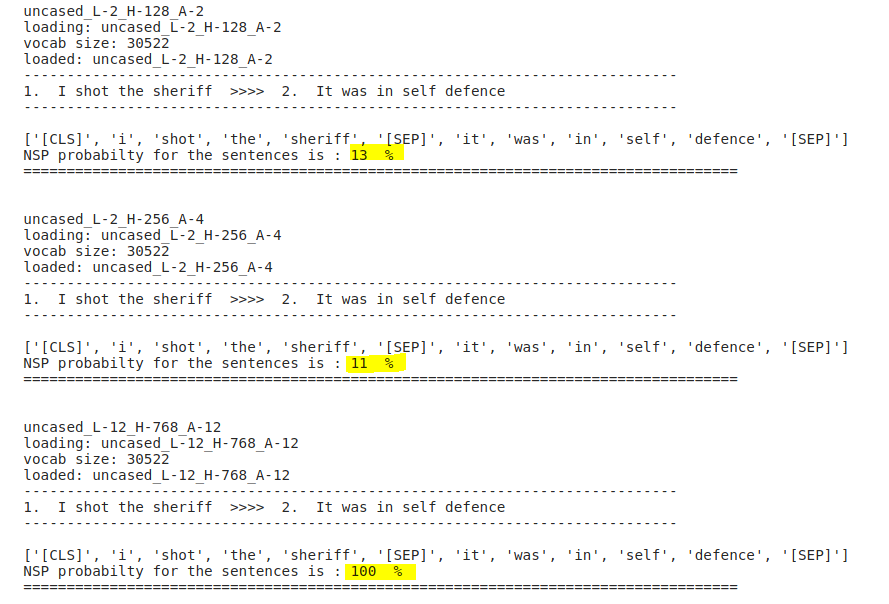
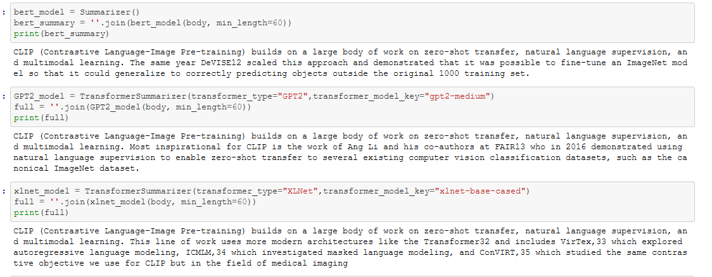

## 1. Playing with BERT base functionality locally NSP mode

Notebook shows how BERT predicts next sentence(NSP mode).

[nsp_compare_sentences.ipynb:](https://github.com/len-sla/NLP/blob/master/nsp_compare_sentences.ipynb)

---
## 2. Predicting BERT in equal sizes
[predict_bert_equal_batches.ipynb:](https://github.com/len-sla/NLP/blob/master/predict_bert_equal_batches.ipynb)

Notebook shows how you can use Google Colab with free GPU to get Bert model predictions. Generally it is nothing special except the times where there is not enough GPU memory to do the task. To make it possible training set is being trained in batches. Below there is example BERT model = 'cased_L-12_H-768_A-12' is used

---
## 3. Text Summarization

[Text Summarization using BERT, GPT2,XLNET.ipynb](https://github.com/len-sla/NLP/blob/master/Text%20Summarization%20using%20BERT%2C%20GPT2%2CXLNET.ipynb)

Text Summarization is the process of shortening a set of data computationally, to create a subset (a summary) that represents the most important or relevant information within the original content.

The sentences, in summary, are generated by the model, not just extracted from the original text data.
Original text was taken froom Internet and was like below

'''
       _CLIP (Contrastive Language–Image Pre-training) builds on a large body of work on zero-shot transfer, natural language supervision, and multimodal learning. The idea of zero-data learning dates back over a decade8 but until recently was mostly studied in computer vision as a way of generalizing to unseen object categories.910 A critical insight was to leverage natural language as a flexible prediction space to enable generalization and transfer. In 2013, Richer Socher and co-authors at Stanford11 developed a proof of concept by training a model on CIFAR-10 to make predictions in a word vector embedding space and showed this model could predict two unseen classes. The same year DeVISE12 scaled this approach and demonstrated that it was possible to fine-tune an ImageNet model so that it could generalize to correctly predicting objects outside the original 1000 training set._

_Most inspirational for CLIP is the work of Ang Li and his co-authors at FAIR13 who in 2016 demonstrated using natural language supervision to enable zero-shot transfer to several existing computer vision classification datasets, such as the canonical ImageNet dataset. They achieved this by fine-tuning an ImageNet CNN to predict a much wider set of visual concepts (visual n-grams) from the text of titles, descriptions, and tags of 30 million Flickr photos and were able to reach 11.5% accuracy on ImageNet zero-shot._

_Finally, CLIP is part of a group of papers revisiting learning visual representations from natural language supervision in the past year. This line of work uses more modern architectures like the Transformer32 and includes VirTex,33 which explored autoregressive language modeling, ICMLM,34 which investigated masked language modeling, and ConVIRT,35 which studied the same contrastive objective we use for CLIP but in the field of medical imaging._

There are several other methods and approaches for text summarization  Here are a few notable ones:

1. Extractive Summarization: Extractive summarization involves selecting and extracting important sentences or phrases from the original text to create a summary. It doesn't involve generating new sentences. Common techniques for extractive summarization include ranking sentences based on importance scores (e.g., using TF-IDF, graph-based algorithms like TextRank or LexRank) and selecting the top-ranked sentences as the summary.

2. Abstractive Summarization: Abstractive summarization aims to generate a summary by understanding the meaning of the original text and generating new sentences that capture the essence of the content. This approach involves natural language generation techniques and can be more flexible in terms of generating summaries that are not limited to exact sentence extraction.

3. Latent Semantic Analysis (LSA): LSA is a statistical technique that represents documents and words as vectors in a high-dimensional space. It can be used for extractive summarization by identifying the most important sentences based on their semantic similarity to the overall document.

4. Latent Dirichlet Allocation (LDA): LDA is a topic modeling technique that assumes each document consists of a mixture of topics. It can be applied to summarization by identifying the most representative topics in the document and selecting sentences that best cover those topics.

5. Graph-based Methods: Graph-based methods, such as TextRank or LexRank, treat the sentences of a document as nodes in a graph and use edge weights to represent the similarity between sentences. By applying algorithms like PageRank, these methods can identify the most important sentences as the summary.

6. Neural Network Architectures: Apart from transformer-based models like T5 and GPT, various neural network architectures have been used for summarization, including sequence-to-sequence models with attention mechanisms, recurrent neural networks (RNNs), and convolutional neural networks (CNNs).

It's worth noting that the choice of summarization method depends on the specific requirements of your task, the amount of training data available, the desired level of extractiveness or abstractiveness, and the computational resources at your disposal. Each method has its strengths and limitations, and it's often beneficial to explore and experiment with different approaches to find the most suitable one for your particular use case. following notebook  presents Graph based method and neuralarchitecture GPT and T5

        '''

---

## 4. BERT question_answering  dockerised and exposed via RESTful API

This is one more  way of automatising, making efficient, ready to use environment almost everywhere( where docker is present).
In this particular case docker is installed on Ubuntu18.04 local machine without GPU to test dockerised ML/NLP environments project etc.
The only limiting factor is is the speed  of internet connection and inference time as it is done  locally on CPU based machine. Of course one could go further pay for 
time of computation power of the cloud and execute dockerised environments in the cloud. Then it is also another step of fintunig ready to use models
in this case question_answering from HuggingFace transformers.pipelines.whole procedure is nicelly described by Jarek Szczegielniak and presented in article (https://www.codeproject.com/Articles/5302894/Exposing-Dockerized-AI-Models-via-RESTful-API) 

There couple of things one need to take care when installing  Docker on  Ubuntu machines( details under this address):
(https://www.digitalocean.com/community/tutorials/how-to-install-and-use-docker-on-ubuntu-18-04).

---
To be able to use dockerised environments for non root users in Ubuntu  threre is need to do couple of ajustments. 
Very extensive reasearch on the subject and helpful tips are  on the (https://stackoverflow.com/questions/48957195/how-to-fix-docker-got-permission-denied-issue#comment101604579_48957722)
especially part presenting solution of Olshansk user( a least for me)

---

Once done all this you could see :

### Libraries
Notebook was inspired by content of https://github.com/google-research/bert. All models from smallest to to standard one could be downloaded from https://storage.googleapis.com/bert_models/2020_02_20/all_bert_models.zip Models were downloaded and uzipped to subirectory models. Everything was done in Conda prepared environment.

 
 

## Status
Project is: _in progress_, 

### Info
Created by [lencz.sla@gmail.com]
